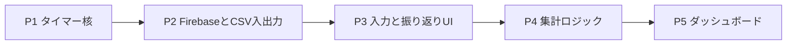

# 工程定義（ポモドーロ・タイマー）

## 1. 実装フェーズ概要

## 2. フェーズ別の内容と完了条件

### P1: タイマー核

- **内容**: カウントダウン、`localStorage` による状態保持、単一セッション。
- **完了条件**: FR-1 を満たす。

### P2: Firestore と CSV 入出力

- **内容**: Google ログイン、セッションの `setDoc`、エクスポート／インポート（バッチ・重複処理）。
- **完了条件**: FR-3 を満たす。

### P3: 入力と振り返り UI

- **内容**: タスク・振り返りの文字数制約、ランク、Firestore 保存。
- **完了条件**: FR-2 を満たす。

### P4: 集計ロジック

- **内容**: ローカル TZ・月曜始まりの週、日／週／月の件数集計。
- **完了条件**: 期間タブで数値が変わる。

### P5: ダッシュボード

- **内容**: `onSnapshot`、カード、棒グラフ、履歴テーブル。
- **完了条件**: FR-4 を満たす。

## 3. 参照

- `要件定義.md`
- `技術定義.md`
